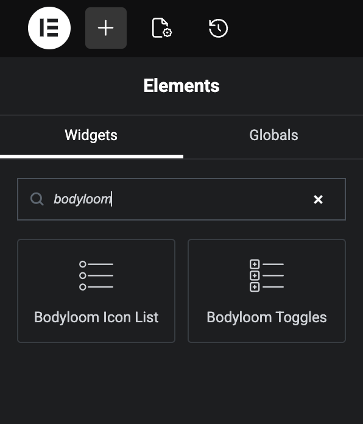

# Vybose Repeater Accordion

**Contributors:** Jimmy Thanki  
**Tags:** toggles, accordion, acf, metabox, pods  
**Requires at least:** 5.0  
**Tested up to:** 7.0  
**Requires PHP:** 7.4  
**Stable tag:** 1.1.0  
**License:** GPLv2 or later  

Vybose Repeater Accordion creates static and dynamic toggles or accordions for Elementor, the Block Editor, and shortcodes.

## Features

- Elementor widget for manually managed static toggles and accordions.
- Dynamic repeater output from ACF Pro, Meta Box, or Pods.
- Editor field pickers for discovered repeater and subfield paths.
- Manual field-path fallbacks when discovery is unavailable or custom paths are preferred.
- Accordion and toggle interaction modes.
- Optional FAQ schema output with hardened JSON-LD encoding.
- Keyboard-accessible frontend controls.
- Gutenberg block and shortcode rendering for non-Elementor layouts.
- Frontend JavaScript that works without Elementor being loaded.
- Defensive provider handling so missing ACF, Meta Box, Pods, or Elementor dependencies do not fatal the site.


## Good Karma Donation
If you found this free plugin to be useful, please consider donating to the dhamma.org Vipassana Meditation organization founded by Sri S.N. Goenka. They provide free meditation retreats to help people ease their suffering and purify their minds, and they operate purely on volunteer work and donations. I will upload my donation receipts on an appropriate cadence if you go through my link, or you may donate directly by following instructions on <a href="https://www.dhamma.org/en/dana" target="_blank">this page</a>.


[](https://www.buymeacoffee.com/aluma)


## Installation

1. Upload `vybose-repeater-accordion` to `/wp-content/plugins/`.
2. Activate the plugin in WordPress.
3. Add the Vybose Repeater Accordion widget, Dynamic Toggles block, or shortcode.

## Usage

Elementor: use the "Vybose Repeater Accordion" widget. Choose Static for hand-authored items or Dynamic for ACF Pro, Meta Box, or Pods repeater data.

Block Editor: use the "Dynamic Toggles" block and configure the source, repeater field, title field, content field, and interaction mode.

Shortcode:

```text
[vybose_repeater_accordion src="acf" repeater="my_repeater" title_field="question" content_field="answer" type="accordion"]
```

Field pickers are convenience controls. Manual fields remain available for compatibility, nested field paths, and providers or field layouts that cannot be discovered safely.

## Screenshots

*Rendered Accordion Example*


*Elementor Elements Panel*



*Content Edit Panel*


*ACF Repeater*


*Pods*


*Meta Box*


*Advanced Edit Panel*


## Changelog

### 1.1.0

- Added editor field pickers with manual field-path fallbacks.
- Added dynamic source selection for ACF Pro, Meta Box, and Pods.
- Registered the Dynamic Toggles block from plugin initialization.
- Improved shortcode and block frontend behavior without requiring Elementor.
- Hardened rendering, JSON-LD output, and metadata for WordPress.org submission.
- Updated screenshot references and documentation for the v1.1.0 feature set.

### 1.0.0

- Initial release.
